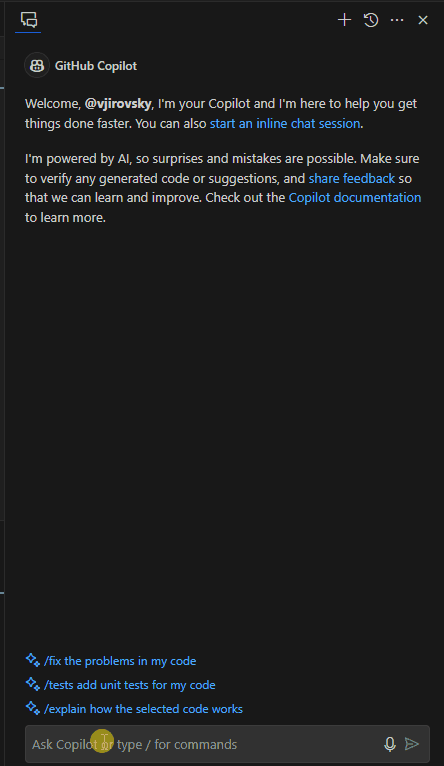
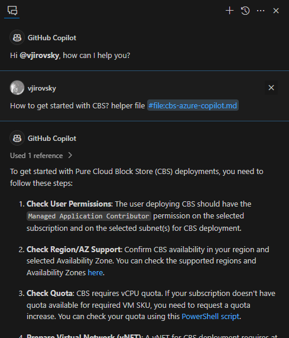

#  GitHub Copilot Helper File for Pure Cloud Block Store Deployments (Preview)

## Description
This repository contains a reference file to enable support about Pure Cloud Block Store during your conversations with GitHub Copilot.




## Usage

1. download the file `cbs-azure-copilot.md`
2. open the file in your IDE with GitHub Copilot support (e.g. Visual Studio Code)
3. open a GitHub Copilot chat
4. reference the file in every your prompt, example:

    ```
    How to get started with CBS? helper file #file:cbs-azure-copilot.md
    ```

    Make sure the `#file` token gets recognized as special command (no copy+paste), you need to type it manually.

    


5. ask GitHub Copilot any question regarding Pure Cloud Block Store deployment


## Disclaimer

*The sample script and documentation are provided AS IS and are not supported by the author or the author's employer, unless otherwise agreed in writing. You bear all risk relating to the use or performance of the sample script and documentation.*

*The author and the author's employer disclaim all express or implied warranties (including, without limitation, any warranties of merchantability, title, infringement or fitness for a particular purpose). In no event shall the author, the author's employer or anyone else involved in the creation, production, or delivery of the scripts be liable for any damages whatsoever arising out of the use or performance of the sample script and documentation (including, without limitation, damages for loss of business profits, business interruption, loss of business information, or other pecuniary loss), even if such person has been advised of the possibility of such damages.*


## License

This project is licensed under the [MIT License](https://opensource.org/licenses/MIT).

## Contact

- [GitHub](https://github.com/vjirovsky)
- [My Website](https://vjirovsky.cz)
